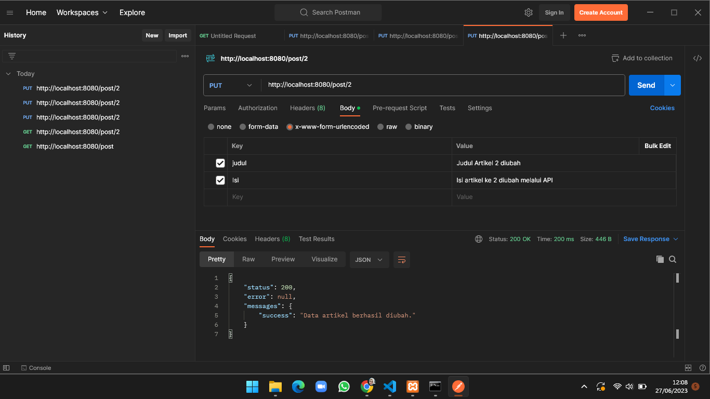
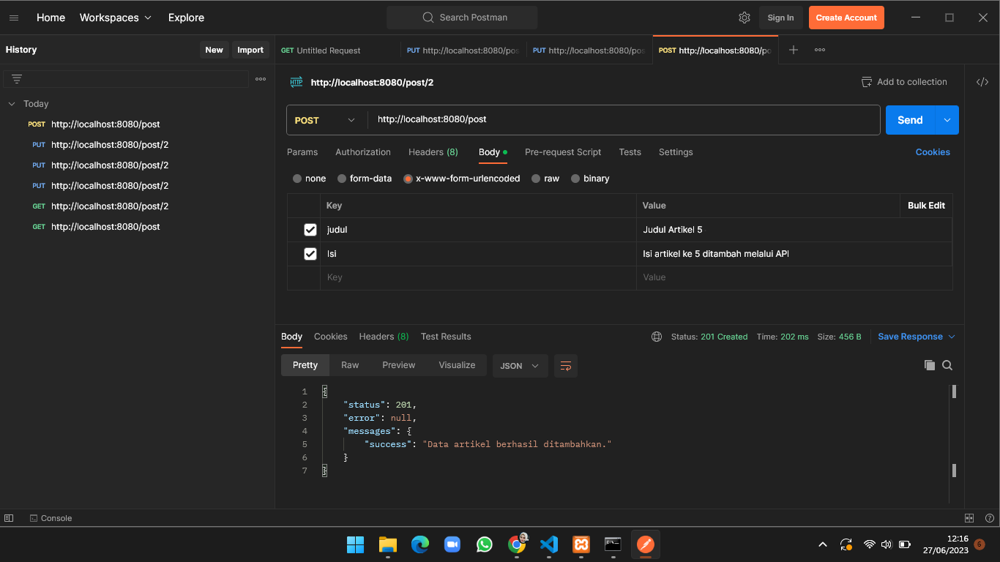
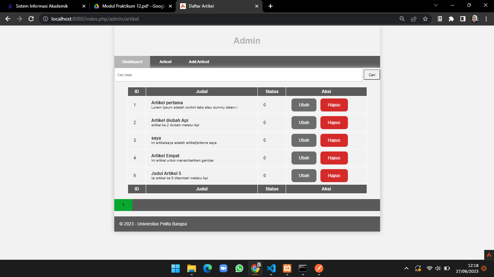
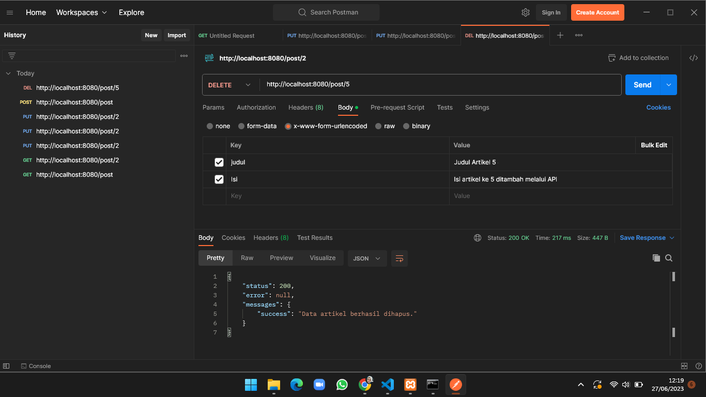
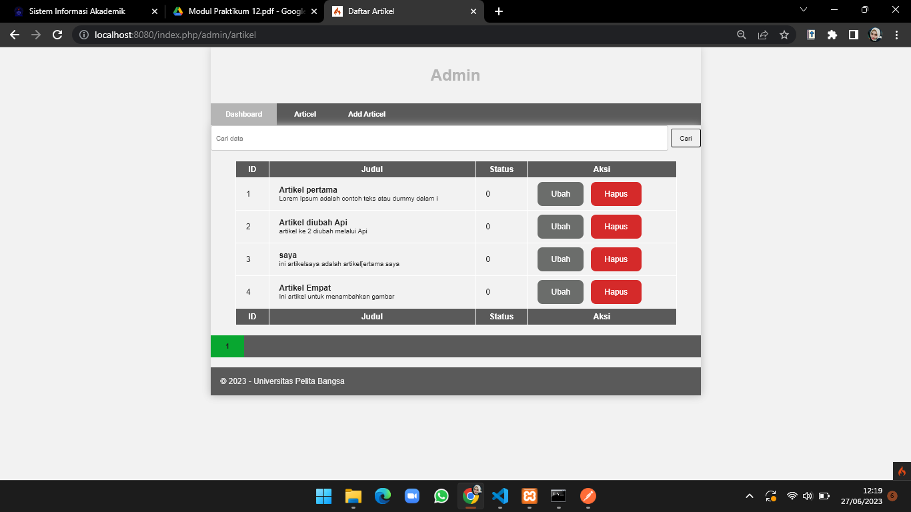

# Lab12Web

### Membuat PHP Frame Work (Codeigniter) Lanjutan <b>

Ini merupakan tugas membuat PHP Frame Work agar dapat diakses melalui API.

1. Membuat REST Controller
Sebelum membuat REST API kita harus mengunduh aplikasi yaitu POSTMAN. Setelah berhasil mengunduh aplikasi tersebut, buatlah file REST Controller yang berisi fungsi untukk menampilkan, menambah dan mengahapus data. Masuklah ke direktori app/Controllers dan buatlah file baru bernama Post.php. Kode dibawah ini
```
<?php
namespace App\Controllers;
use CodeIgniter\RESTful\ResourceController;
use CodeIgniter\API\ResponseTrait;
use App\Models\ArtikelModel;
class Post extends ResourceController
{
use ResponseTrait;
// all users
public function index()
{
$model = new ArtikelModel();
$data['artikel'] = $model->orderBy('id', 'DESC')->findAll();
return $this->respond($data);
}
// create
public function create()
{
$model = new ArtikelModel();
$data = [
'judul' => $this->request->getVar('judul'),
'isi' => $this->request->getVar('isi'),
];
$model->insert($data);
$response = [
'status' => 201,
'error' => null,
'messages' => [
'success' => 'Data artikel berhasil ditambahkan.'
]
];
return $this->respondCreated($response);
}
// single user
public function show($id = null)
{
   $model = new ArtikelModel();
$data = $model->where('id', $id)->first();
if ($data) {
return $this->respond($data);
} else {
return $this->failNotFound('Data tidak ditemukan.');
}
}
// update
public function update($id = null)
{
$model = new ArtikelModel();
$id = $this->request->getVar('id');
$data = [
'judul' => $this->request->getVar('judul'),
'isi' => $this->request->getVar('isi'),
];
$model->update($id, $data);
$response = [
'status' => 200,
'error' => null,
'messages' => [
'success' => 'Data artikel berhasil diubah.'
]
];
return $this->respond($response);
}
// delete
public function delete($id = null)
{
$model = new ArtikelModel();
$data = $model->where('id', $id)->delete($id);
if ($data) {
$model->delete($id);
$response = [
'status' => 200,
'error' => null,
'messages' => [
'success' => 'Data artikel berhasil dihapus.'
]
];
return $this->respondDeleted($response);
} else {
return $this->failNotFound('Data tidak ditemukan.');
}
}
}
```

2. Membuat Routing REST API
Untuk mengakses REST API CodeIgniter, kita perlu mendefinisikan route-nya terlebih dulu.
Caranya, masuklah ke direktori app/Config dan bukalah file Routes.php. Tambahkan kode
di bawah ini:
```
$routes->resource('post');
```

3. Testing REST API CodeIgniter
Kita melakukan testing pada aplikasi postman.


> Gambar diatas merupakan mungubah data dengan method PUT dengan memasukan bURL artikel yaitu http://localhost:8080/post/2



> Gambar diatas merupakan menambahkan data dengan method POST dengan memasukan URL berikut http://localhost:8080/post



> Gambar diatas merupakan hasil dari mengubah dan menambahkan data.



> Gambar diatas merupakan menghapus data dengan method DELETE untuk menghapus data dengan memasukan URL http://localhost:8080/post/5 untuk mengahapus artikel 5.



> Gambar diatas merupakan hasil setelah kita mengahapus artikel 5.